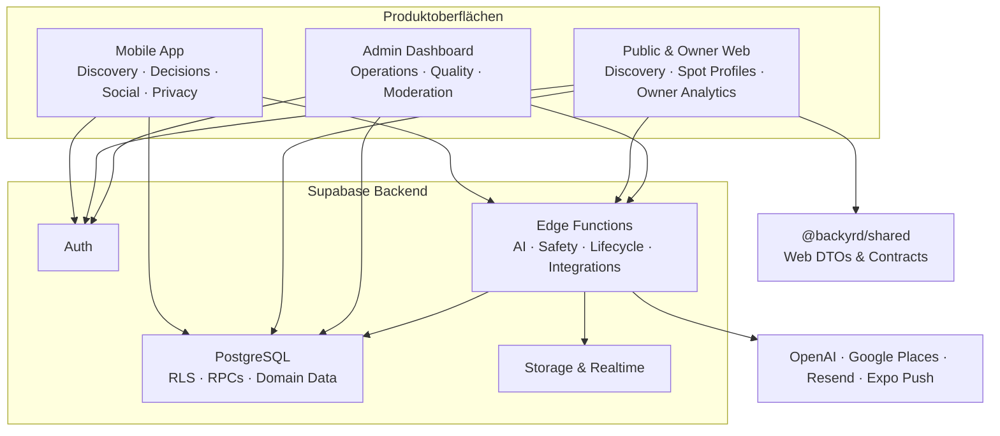

# Backyrd

> AI-powered experience discovery for real-life moments.

Backyrd hilft Menschen, Orte und Erlebnisse zu finden, die zu ihrer aktuellen Stimmung, Situation und ihrem persönlichen Geschmack passen. Das Produkt beantwortet nicht primär die Frage „Welcher Ort hat die höchste Bewertung?“, sondern „Was passt genau jetzt zu mir?“.

Backyrd ist deshalb keine klassische Review- oder Rating-Plattform. Reviews sind kurze, authentische Erfahrungssignale. Sie dienen dazu, zukünftige Empfehlungen zu verbessern – nicht dazu, Aufmerksamkeit oder möglichst viele Bewertungen zu erzeugen.

## Wie Backyrd funktioniert

Der zentrale Produktkreislauf verbindet eine Entscheidung mit der späteren realen Erfahrung:

```text
Mood + Kontext + Absicht
        ↓
passende Spots entdecken
        ↓
Spot auswählen oder speichern
        ↓
reale Erfahrung als Moment oder Review festhalten
        ↓
Taste- und Vertrauenssignale für zukünftige Empfehlungen
```

Empfehlungen berücksichtigen unter anderem Mood, Ort, Distanz, Zeitpunkt, Begleitung, persönliche Präferenzen, soziale Signale und Datenqualität. Popularität ist ein Signal, aber nicht das Ziel der Optimierung.

Die Produktentscheidungen folgen fünf Grundsätzen:

- **Mood statt Sterne:** Ein Erlebnis wird durch seine Atmosphäre und Eignung beschrieben, nicht auf eine Zahl reduziert.
- **Kontext statt Popularität:** Der beste Spot hängt von Situation und Absicht ab.
- **Erlebnisse statt Review-Masse:** Feedback bleibt leichtgewichtig und verbessert die nächste Entscheidung.
- **Vertrauen vor Engagement:** Backyrd optimiert weder auf Spam noch auf endloses Scrollen.
- **KI unterstützt, Menschen entscheiden:** KI erklärt und priorisiert; menschliche Moderation bleibt final.

## Systemüberblick

Backyrd besteht aus drei Produktoberflächen und einem gemeinsamen Supabase-Backend:



### Verantwortungsgrenzen

| Bereich | Verantwortung |
| --- | --- |
| Mobile App | Primäre Consumer Experience: Discovery, Decision Engine, Journeys, Reviews, Social, Messaging und Privacy |
| Public Web | Öffentliche Landing-, Discovery- und Spot-Seiten |
| Owner Web | Verifizierte Spot-Verwaltung und Analytics ohne direkten Einfluss auf Rankings |
| Admin Dashboard | Interne Operations für Spots, Claims, Nutzer, Taxonomie, Qualität, Moderation und Safety |
| PostgreSQL | Domänendaten, RLS-Policies, Transaktionen, Aggregationen und versionierte RPCs |
| Edge Functions | Privilegierte oder externe Abläufe wie AI, semantische Suche, Uploads, Safety, E-Mail, Push und Datenrechte |
| Trust & Safety | Signale, Cases, Entscheidungen und Appeals; Signale sind Hinweise, keine Beweise |

Clients authentifizieren sich mit dem Supabase-Anon-Key. Autorisierung wird im Backend durch Row Level Security und domänenspezifische RPCs erzwungen. Service-Role-Keys und externe API-Secrets dürfen ausschließlich in serverseitigen Routen oder Edge Functions verwendet werden.

## Repositorystruktur

```text
backyrd/
├── mobile/                 Expo-App für iOS und Android
├── web/                    Next.js-App für Public Web und Owner Portal
├── admin-dashboard/        separates internes Next.js-Dashboard
├── packages/shared/        gemeinsam genutzte Web-DTOs und Verträge
├── supabase/
│   ├── migrations/         kanonische, versionierte Datenbankänderungen
│   ├── functions/          kanonische Supabase Edge Functions
│   ├── config.toml         lokale Supabase-Konfiguration
│   └── seed.sql            Seed-Einstiegspunkt; derzeit leer
├── docs/                   interne Betriebs- und Safety-Dokumentation
├── legal/                  Community-, Moderations- und Appeals-Richtlinien
└── scripts/                Wartungs- und Importskripte
```

Die Root-npm-Workspaces umfassen nur `web` und `packages/*`. `mobile` und `admin-dashboard` besitzen eigene Lockfiles und werden separat installiert.

Weitere eingecheckte Bereiche sind nicht Teil des regulären Runtime-Pfads:

- `mobile/supabase/functions/` enthält zusätzliche, mobile-nahe Function-Quellen außerhalb des kanonischen Supabase-Projekts im Root.
- `web/src/app/` enthält eine ältere parallele Page-Quelle; die aktive Next.js-App liegt unter `web/app/`.
- `app.json` und `eas.json` im Root definieren eine zweite Expo/EAS-Konfiguration. Für die Mobile-App sind in diesem Dokument `mobile/app.config.ts` und `mobile/eas.json` maßgeblich.
- `mobu/` ist ein eigenständiger Expo-Prototyp und kein Backyrd-Produktmodul.
- `backups/`, versteckte Backup-Verzeichnisse, Audit-Dateien und `backyrd_spot_quality_*` sind historische Arbeitsartefakte oder Installer.

Neue Produktlogik gehört in die kanonischen Laufzeitbereiche. Historische Artefakte dürfen nicht als Implementierungsvorlage oder Deployment-Quelle behandelt werden.

## Technologie

- **Mobile:** Expo, React Native, Expo Router und TypeScript
- **Web und Admin:** Next.js, React, TypeScript und Tailwind CSS
- **Backend:** Supabase Auth, PostgreSQL, Storage, Realtime, RLS und SQL RPCs
- **Serverless:** Supabase Edge Functions mit Deno und TypeScript
- **AI und Enrichment:** OpenAI, Embeddings, semantische Suche und Google Places
- **Mobile Delivery:** EAS Build und EAS Update

Die verbindlichen Versionen stehen in den jeweiligen `package.json`-, Lock- und Expo-Konfigurationsdateien; diese README dupliziert sie bewusst nicht.

## Lokale Entwicklung

### Voraussetzungen

- Node.js 20 und npm
- Docker für den lokalen Supabase-Stack
- Xcode und CocoaPods für native iOS-Builds
- Android Studio und Android SDK für native Android-Builds

Die Mobile-App definiert die erwartete Node-Version über Volta in `mobile/package.json`. Die Supabase CLI ist als Root-Dev-Dependency installiert.

### 1. Abhängigkeiten installieren

```bash
git clone https://github.com/PhiluLan/backyrd.git
cd backyrd

npm ci
npm --prefix mobile ci
npm --prefix admin-dashboard ci
```

### 2. Lokales Backend starten

```bash
npm run supabase:start
npm run supabase:status
```

Der erste Start wendet die Migrationen unter `supabase/migrations/` an. Die lokale API ist anschließend standardmäßig unter `http://127.0.0.1:54321` und Supabase Studio unter `http://127.0.0.1:54323` erreichbar.

`supabase/seed.sql` ist derzeit leer. Ein frischer Stack enthält daher Schema und Policies, aber keine produktnahen Spots, Admin-Nutzer oder Testkonten. Vollständige Discovery-, Owner- und Admin-Flows benötigen geeignete Testdaten und Rollen in einer lokalen oder isolierten Umgebung.

### 3. Umgebungsvariablen setzen

Lege lokale `.env`-Dateien an; sie werden von Git ignoriert. Die lokalen Supabase-Werte liefert `npm run supabase:status`. Das Repository enthält noch keine `.env.example`-Dateien; bis diese ergänzt werden, ist die folgende Tabelle der minimale Konfigurationsvertrag.

| Anwendung | Datei | Erforderlich | Optional oder funktionsabhängig |
| --- | --- | --- | --- |
| Mobile | `mobile/.env` | `EXPO_PUBLIC_SUPABASE_URL`, `EXPO_PUBLIC_SUPABASE_ANON_KEY` | `APP_VARIANT`, `EXPO_PUBLIC_GOOGLE_MAPS_KEY` |
| Public/Owner Web | `web/.env.local` | `NEXT_PUBLIC_SUPABASE_URL`, `NEXT_PUBLIC_SUPABASE_ANON_KEY` | `NEXT_PUBLIC_SITE_URL`, `NEXT_PUBLIC_APP_DOWNLOAD_URL` |
| Admin | `admin-dashboard/.env.local` | `NEXT_PUBLIC_SUPABASE_URL`, `NEXT_PUBLIC_SUPABASE_ANON_KEY` | `NEXT_PUBLIC_SITE_URL`, `NEXT_PUBLIC_GOOGLE_API_KEY`, serverseitig `SUPABASE_SERVICE_ROLE_KEY` |
| Edge Functions | `supabase/.env` | abhängig von der Function | unter anderem `OPENAI_API_KEY`, `GOOGLE_PLACES_API_KEY`, `RESEND_API_KEY` und Worker-/Webhook-Secrets |

Minimalbeispiel für die Mobile-App:

```dotenv
EXPO_PUBLIC_SUPABASE_URL=http://127.0.0.1:54321
EXPO_PUBLIC_SUPABASE_ANON_KEY=<anon-key-aus-supabase-status>
APP_VARIANT=dev
```

Variablen mit `EXPO_PUBLIC_` oder `NEXT_PUBLIC_` werden in Client-Bundles eingebettet und sind keine Secret-Speicher. Privilegierte Schlüssel gehören niemals in diese Variablen.

Einige ältere Mobile-Hilfsquellen referenzieren noch `EXPO_PUBLIC_OPENAI_KEY`. Das ist keine unterstützte Sicherheitsgrenze: Verwende dort keinen produktiven OpenAI-Key; neue AI-Aufrufe gehören hinter eine Edge Function.

### 4. Gewünschte Oberfläche starten

| Oberfläche | Befehl | Standardadresse |
| --- | --- | --- |
| Mobile / Expo Dev Server | `npm --prefix mobile run start` | Expo-Ausgabe folgen |
| Public & Owner Web | `npm --workspace web run dev` | `http://localhost:3000` |
| Admin Dashboard | `npm --prefix admin-dashboard run dev -- -p 3001` | `http://localhost:3001` |

Für Kamera, Push, Maps und andere native Integrationen ist ein Development Build zuverlässiger als Expo Go. Das Admin-Dashboard erfordert zusätzlich einen authentifizierten Nutzer, für den `admin_is_admin_v1` positiv ausfällt.

### 5. Edge Functions lokal ausführen

```bash
npx supabase functions serve <function-name> --env-file supabase/.env
```

Ohne die jeweils benötigten Secrets funktionieren AI-, E-Mail-, Push-, Safety- und Google-Places-Flows nicht vollständig. Secrets für Cloud-Umgebungen werden über die Supabase-Secret-Verwaltung gesetzt und nicht committed.

Häufige Backend-Befehle:

```bash
# Neue Schemaänderung anlegen
npx supabase migration new <name>

# Lokale Datenbank neu aus Migrationen aufbauen (löscht lokale Daten)
npm run supabase:reset

# Lokalen Stack stoppen
npm run supabase:stop
```

## Entwicklungsworkflow

1. Lies vor Änderungen die verbindlichen Produkt- und Engineering-Regeln in [`AGENTS.md`](./AGENTS.md).
2. Suche nach bestehenden Komponenten, Services, Hooks, RPCs und Migrationen, bevor du neue Logik einführst.
3. Ordne die Änderung einer Domäne und allen betroffenen Oberflächen zu; Owner-, Admin- und Mobile-Auswirkungen dürfen nicht isoliert betrachtet werden.
4. Implementiere Schemaänderungen ausschließlich als neue Migration. Ändere keine bereits angewandte Migration und schwäche keine RLS-Policy ab.
5. Prüfe mindestens Lint und Build der betroffenen Anwendung sowie kritische Auth-, RLS-, Safety- und Moderationspfade manuell.

```bash
# Mobile
npm --prefix mobile run lint

# Public & Owner Web
npm --workspace web run lint
npm --workspace web run build

# Admin Dashboard
npm --prefix admin-dashboard run lint
npm --prefix admin-dashboard run build
```

Das Repository enthält derzeit keine automatisierte Test-Suite und keine CI-Workflows. Das ist insbesondere für Datenbank-, Berechtigungs- und Trust-&-Safety-Änderungen eine relevante Qualitätssicherungslücke.

`AGENTS.md` ist die aktuelle Source of Truth für Produkt- und Implementierungsprinzipien. Vor einer Öffnung für externe Contributions sollte ein separates `CONTRIBUTING.md` Branch-, Review-, Test- und Release-Konventionen dokumentieren, statt diese README weiter auszubauen.

## Weiterführende Dokumentation

- [`AGENTS.md`](./AGENTS.md) – Produktphilosophie und verbindliche Engineering-Regeln
- [`docs/safety/MODERATION_SOP.md`](./docs/safety/MODERATION_SOP.md) – operativer Moderationsablauf
- [`docs/safety/TRANSPARENCY_MONITORING.md`](./docs/safety/TRANSPARENCY_MONITORING.md) – Transparenz und Monitoring
- [`legal/safety/COMMUNITY_GUIDELINES.md`](./legal/safety/COMMUNITY_GUIDELINES.md) – Community Guidelines
- [`legal/safety/MODERATION_POLICY.md`](./legal/safety/MODERATION_POLICY.md) – Moderationsrichtlinie
- [`legal/safety/ENFORCEMENT_POLICY.md`](./legal/safety/ENFORCEMENT_POLICY.md) – Durchsetzungsrichtlinie
- [`legal/safety/APPEALS_POLICY.md`](./legal/safety/APPEALS_POLICY.md) – Einspruchsverfahren

## Lizenz

Dieses Repository enthält derzeit keine `LICENSE`-Datei. Ohne ausdrückliche Lizenz werden keine Nutzungs-, Änderungs- oder Weiterverteilungsrechte eingeräumt.
