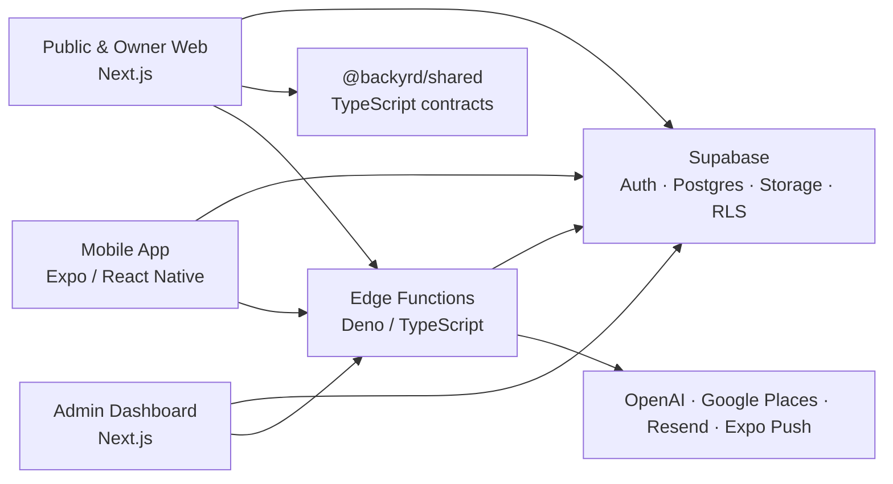

# Backyrd

> AI-powered experience discovery for real-life moments.

Backyrd hilft Menschen, Restaurants, Cafés, Bars, Hotels, Aktivitäten und andere Erlebnisse passend zu ihrer aktuellen Stimmung und Situation zu entdecken. Im Mittelpunkt stehen nicht Sternebewertungen, sondern Mood, Kontext, persönliche Vorlieben und vertrauenswürdige Signale aus echten Erfahrungen.

Das Repository enthält die mobile App, die öffentliche und Owner-Weboberfläche, ein internes Admin-Dashboard, gemeinsame TypeScript-Verträge sowie das Supabase-Backend.

## Produktprinzipien

- **Mood statt Sterne:** Empfehlungen beschreiben, wie sich ein Ort anfühlt.
- **Kontext statt Popularität:** Zeit, Begleitung, Wetter, Distanz und Absicht verändern die passende Empfehlung.
- **Erlebnisse statt Review-Masse:** Reviews sind kurze, authentische Signale für zukünftige Entscheidungen.
- **Vertrauen vor Engagement:** Moderation und Review-Integrität unterstützen Menschen, ersetzen aber keine menschliche Entscheidung.
- **AI assists, humans decide:** KI hilft beim Entdecken, Erklären und Moderieren, ohne Unsicherheit zu verstecken.

## Aktueller Funktionsumfang

Der derzeitige Code bildet unter anderem folgende Produktbereiche ab:

- kontext- und moodbasierte Spot-Empfehlungen über die Decision Engine
- Suche, Explore-Ansicht, Karte und öffentliche Spot-Detailseiten
- Journeys und personalisierte Discovery-Signale
- kurze Reviews mit Fotos und Mood-Zuordnung
- Social Feed, Profile, Follows, Likes, Kommentare und Direktnachrichten
- Spot-Einreichung, Claims und Owner-Verwaltung mit Analytics
- Push-Benachrichtigungen
- Privacy Center mit Einwilligungen, Datenexport und Account-Löschung
- Trust & Safety mit Meldungen, Moderation, Appeals und Integrity-Signalen
- internes Spot-Quality- und Google-Places-Enrichment

## Architektur



Die Clients verwenden den Supabase-Anon-Key und greifen auf durch Row Level Security geschützte Daten zu. Privilegierte Schlüssel und externe API-Secrets gehören ausschließlich in serverseitige Routen oder Supabase Edge Functions.

## Repositorystruktur

| Pfad | Zweck |
| --- | --- |
| `mobile/` | Expo-54-App für iOS, Android und Web mit Expo Router |
| `web/` | Öffentliche Discovery- und Spot-Seiten sowie Owner-Portal auf Next.js 16 |
| `admin-dashboard/` | Geschütztes internes Dashboard für Spots, Reviews, Nutzer, Claims, Taxonomie, Qualität und Safety |
| `packages/shared/` | Gemeinsame DTOs und Verträge für Spots, Home und Reviews |
| `supabase/migrations/` | Versionierte PostgreSQL-Schemaänderungen inklusive RLS und RPCs |
| `supabase/functions/` | Edge Functions für Decisions, Suche, Reviews, Safety, Benachrichtigungen, Privacy und Enrichment |
| `supabase/seed.sql` | Seed-Daten für die lokale Supabase-Instanz |
| `docs/` und `legal/` | Moderations-, Transparenz- und Safety-Richtlinien |
| `scripts/` | Wartungs- und Importskripte, unter anderem für OpenStreetMap-Daten |

Zusätzlich enthält das Repository historische Backups, Audit-Artefakte und einmalige Installationsskripte. Sie sind nicht Teil des regulären Build- oder Runtime-Pfads. `mobu/` ist ein separates Expo-Projekt und gehört nicht zur Backyrd-Produktarchitektur.

## Technologie

| Bereich | Stack |
| --- | --- |
| Mobile | Expo 54, React Native 0.81, React 19, Expo Router, Zustand, React Native Maps |
| Web | Next.js 16, React 19, TypeScript, Tailwind CSS 4 |
| Backend | Supabase Auth, PostgreSQL 17, Storage, Realtime, RLS, SQL RPCs |
| Serverless | Supabase Edge Functions mit Deno und TypeScript |
| AI und Daten | OpenAI, Embeddings, semantische Spot-Suche, Google Places |
| Builds | EAS Build / Updates, native iOS- und Android-Projekte |

## Voraussetzungen

- Node.js 20 (die Mobile-App ist auf `20.19.4` festgelegt)
- npm
- Docker für die lokale Supabase-Umgebung
- Supabase CLI (wird im Root-Projekt als Dev Dependency bereitgestellt)
- Xcode und CocoaPods für lokale iOS-Builds
- Android Studio und Android SDK für lokale Android-Builds

## Lokale Einrichtung

### 1. Repository installieren

Die Root-Workspaces umfassen `web` und `packages/*`. Mobile und Admin besitzen jeweils einen eigenen Lockfile und werden separat installiert.

```bash
git clone https://github.com/PhiluLan/backyrd.git
cd backyrd
npm install
npm --prefix mobile install
npm --prefix admin-dashboard install
```

### 2. Umgebungsvariablen konfigurieren

Lege lokale `.env`-Dateien an und committe sie nicht. Das Repository enthält aktuell keine vollständigen `.env.example`-Dateien.

`mobile/.env`:

```dotenv
EXPO_PUBLIC_SUPABASE_URL=http://127.0.0.1:54321
EXPO_PUBLIC_SUPABASE_ANON_KEY=<local-anon-key>
EXPO_PUBLIC_GOOGLE_MAPS_KEY=<google-maps-key>
APP_VARIANT=dev
```

`web/.env.local`:

```dotenv
NEXT_PUBLIC_SUPABASE_URL=http://127.0.0.1:54321
NEXT_PUBLIC_SUPABASE_ANON_KEY=<local-anon-key>
NEXT_PUBLIC_SITE_URL=http://localhost:3000
NEXT_PUBLIC_APP_DOWNLOAD_URL=<optional-app-link>
```

`admin-dashboard/.env.local`:

```dotenv
NEXT_PUBLIC_SUPABASE_URL=http://127.0.0.1:54321
NEXT_PUBLIC_SUPABASE_ANON_KEY=<local-anon-key>
NEXT_PUBLIC_SITE_URL=http://localhost:3001
NEXT_PUBLIC_GOOGLE_API_KEY=<google-places-key>
SUPABASE_SERVICE_ROLE_KEY=<local-service-role-key>
```

Je nach bereitgestellter Edge Function werden serverseitig außerdem Secrets wie `OPENAI_API_KEY`, `GOOGLE_PLACES_API_KEY`, `RESEND_API_KEY` und Worker-/Webhook-Secrets benötigt. Setze sie lokal in `supabase/.env` oder für ein verknüpftes Cloud-Projekt über die Supabase CLI.

> `EXPO_PUBLIC_*` und `NEXT_PUBLIC_*` werden in Client-Bundles eingebettet. Dort dürfen niemals Service-Role-Keys oder andere privilegierte Secrets stehen.

### 3. Supabase starten

```bash
npm run supabase:start
npm run supabase:status
```

Der lokale Stack nutzt standardmäßig:

- API: `http://127.0.0.1:54321`
- PostgreSQL: Port `54322`
- Supabase Studio: `http://127.0.0.1:54323`
- Inbucket: `http://127.0.0.1:54324`

Migrationen und `supabase/seed.sql` werden bei einem lokalen Reset neu angewendet:

```bash
npm run supabase:reset
```

Der Reset verwirft die Daten der lokalen Supabase-Instanz. Er darf nicht als Produktionsworkflow verwendet werden.

### 4. Apps starten

Mobile-App:

```bash
npm --prefix mobile run start
```

Alternativ stehen `android`, `ios` und `web` als Mobile-Skripte zur Verfügung. Für native Features ist ein Development Build in der Regel geeigneter als Expo Go.

Öffentliche und Owner-Web-App:

```bash
npm --workspace web run dev
```

Admin-Dashboard auf einem separaten Port:

```bash
npm --prefix admin-dashboard run dev -- -p 3001
```

Der Zugriff auf das Admin-Dashboard setzt eine gültige Supabase-Session und eine positive Antwort der RPC `admin_is_admin_v1` voraus.

## Datenbank und Edge Functions

Schemaänderungen werden ausschließlich als neue Migration unter `supabase/migrations/` umgesetzt. Bestehende Migrationen sollten nach ihrer Anwendung nicht nachträglich verändert werden.

Nützliche Befehle:

```bash
# Neue Migration erzeugen
npx supabase migration new <name>

# Edge Function lokal ausführen
npx supabase functions serve <function-name> --env-file supabase/.env

# Lokalen Stack stoppen
npm run supabase:stop
```

Die vorhandenen Edge Functions decken aktuell unter anderem Decision-Generierung, semantische Suche, Embeddings, Journey-Erzeugung, Review-Uploads, Safety-Evaluierung, Push-Nachrichten, Datenexport, Account-Löschung und Google-Places-Enrichment ab.

## Qualitätssicherung

Vor einem Commit sollten mindestens die betroffenen Anwendungen geprüft werden:

```bash
# Mobile
npm --prefix mobile run lint

# Web
npm --workspace web run lint
npm --workspace web run build

# Admin
npm --prefix admin-dashboard run lint
npm --prefix admin-dashboard run build
```

Das Repository definiert derzeit keine automatisierte Test-Suite und keine CI-Workflows. Änderungen an Datenbanklogik, RLS, Auth, Safety oder Owner/Admin-Berechtigungen benötigen deshalb zusätzlich gezielte manuelle Tests gegen eine lokale oder isolierte Supabase-Umgebung.

## Entwicklungsregeln

- Vor einer Implementierung bestehende Komponenten, Hooks, Services, RPCs und Migrationen suchen und wiederverwenden.
- Änderungen klein, nachvollziehbar und rückwärtskompatibel halten.
- TypeScript strikt typisieren und `any` vermeiden.
- RLS niemals umgehen oder abschwächen.
- Integrity-Signale als Hinweise behandeln, nicht als Beweise; permanente automatische Sanktionen sind ausgeschlossen.
- Mobile, öffentliche Web-App, Owner-Portal und Admin-Dashboard bei domänenübergreifenden Änderungen gemeinsam betrachten.
- Keine Backup-Dateien anlegen: Git ist die Versionshistorie.

Weitere verbindliche Produkt- und Engineering-Grundsätze stehen in [`AGENTS.md`](./AGENTS.md).

## Dokumentation

- [`docs/safety/MODERATION_SOP.md`](./docs/safety/MODERATION_SOP.md) – Moderationsabläufe
- [`docs/safety/TRANSPARENCY_MONITORING.md`](./docs/safety/TRANSPARENCY_MONITORING.md) – Transparenz und Monitoring
- [`legal/safety/COMMUNITY_GUIDELINES.md`](./legal/safety/COMMUNITY_GUIDELINES.md) – Community Guidelines
- [`legal/safety/APPEALS_POLICY.md`](./legal/safety/APPEALS_POLICY.md) – Einspruchsverfahren
- [`legal/safety/ENFORCEMENT_POLICY.md`](./legal/safety/ENFORCEMENT_POLICY.md) – Durchsetzungsrichtlinie
- [`legal/safety/MODERATION_POLICY.md`](./legal/safety/MODERATION_POLICY.md) – Moderationsrichtlinie

## Repositorystatus und Lizenz

Backyrd befindet sich in aktiver Entwicklung. Öffentliche und interne Schnittstellen können sich ändern; Datenbankänderungen bleiben dabei migrationsbasiert und sollen rückwärtskompatibel erfolgen.

Dieses Repository enthält derzeit keine `LICENSE`-Datei. Ohne ausdrückliche Lizenz werden keine Nutzungs-, Änderungs- oder Weiterverteilungsrechte eingeräumt.
