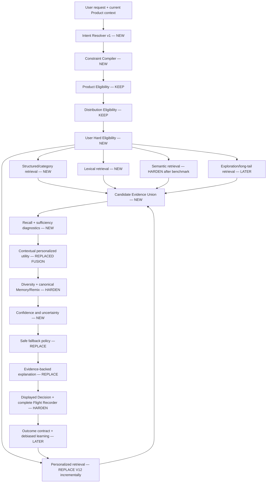
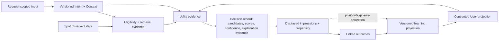

# D4 — Backyrd Decision Next-Generation Architecture v1

## 1. Executive Summary

D4 recommends an incremental **structured hybrid Decision architecture**, not a V13 weight patch and not a Big-Bang rewrite. The architecture preserves the two proven V13 integrity boundaries—Product Eligibility and Distribution Eligibility—while separating five responsibilities that V13 currently mixes:

1. understand the current request as a versioned structured Intent;
2. compile non-compensable requirements into hard User Eligibility;
3. retrieve broadly from complementary sources;
4. rank only eligible candidates by contextual and personalized utility;
5. produce confidence, fallback and explanations from recorded evidence.

The evidence determines the order. D3 found 21/126 hard-constraint failures and 118 primary retrieval records, but only two primary ranking records. Therefore the first implementation wave is **Intent Contract + Hard User Constraint Integrity**, followed by Retrieval. Context, personalization and utility/fusion follow only once valid candidates can reliably enter the pool. Semantic Retrieval is retained and benchmarked, not replaced: D3 used `FAST_SIMULATION`, so its real relevance is still unknown.

The recommended migration is a series of comparable internal Engine versions behind a server-side selector. Each wave runs offline against the frozen V13 D3-A baseline, then in shadow mode, and remains independently reversible. No Next-Generation Product Engine is implemented in D4.

## 2. Evidence and decision boundary

Canonical evidence is the current repository at D4 start (`main` merge `dfb503f755957b9f85f5167328c7ec6a588bd832`), especially D0 mechanics/findings, D1 Lab contracts, D2.1/D2.2 freezes and D3 baseline/failure decomposition. D3 measured:

- 126 Decisions across three seeds and 42 Golden Scenarios;
- 21/126 Decisions with hard User-constraint violations;
- 118 Retrieval, 16 Constraint, five Opening-hours and two Ranking failure records;
- Product and Distribution Eligibility at 126/126;
- NDCG@10 `0.5274`, Precision@10 `0.3190`;
- Counterfactual directional response `5/15`;
- Personalization mean lift `-0.00251`, harm `5/18`;
- Remix overlap `62.86%`, utility delta `-0.01373`;
- Explanation support/partial support `59.44%`;
- no natural semantic-only or fallback final exposure.

D3's semantic and aggregate quality are `SIMULATION_ONLY / STRUCTURALLY_VALIDATED`. Any decision about semantic model, document, thresholds or candidate limits remains conditional on the Full-Fidelity benchmark in section 23.

## 3. Protect these strengths

These become permanent non-regression requirements:

| Proven strength | Evidence | Protection in VNext |
|---|---:|---|
| Product Eligibility | 126/126 | Reuse canonical approved-only boundary; fail closed before public output |
| Distribution Eligibility | 126/126 | Reuse Trust/Distribution contract; ranking cannot re-admit quarantined/excluded candidates |
| Authenticated canonical path reliability | 126/126 without exception, timeout or malformed response | Keep bounded, observable server orchestration and degradation paths |
| Result availability in Lab | 0/126 empty results | Preserve only as a soft availability objective; never trade hard constraints for a result |
| Overlap evidence | overlap candidates mean utility `0.4586` vs V12-only `0.3787` | Preserve multi-source evidence as a useful confidence feature, not a fixed bonus |
| Flight Recorder / reproducibility | all D3 arms executable under frozen identities | Extend evidence schema; never create an opaque ranking path |

No-result is permitted when every candidate violates a hard constraint. The historic zero-empty rate is not an integrity gate.

## 4. Prioritized Problem Map

Severity is architectural priority, not a new D2 verdict. Frequency uses D3 exposure where available.

| Problem | Severity | Frequency/effect | Users/contexts | Confidence | Cause | Current layer |
|---|---|---|---|---|---|---|
| Hard category/exclusion/open-now compensation | P0 | 21/126; category 13/18, exclusion 3/9, open 5/6 | explicit constraints | High | Engine | V13 scoring / absent eligibility |
| Candidate recall | P1 | 118 records; mean eligible Top-1 loss `0.2962` | broad | High structurally, semantic attribution limited | Engine + data | V11/V12/Semantic limits |
| Current-intent authority | P1 | 5/15 directional-positive; 95.29% overlap | changed occasion/time/type | Medium | Engine + representation | parser, retrieval, fusion |
| Personalization benefit | P1 | harm 5/18; power mean `-0.02133` | mature/power | Medium | Engine + sparse/noisy history | Taste/profile/memory/fusion |
| Remix alternatives | P1 | 112 repeats; 1.78 new; negative utility delta | repeat Decision | High | Engine | exclusions, retrieval, memory |
| Explanation alignment | P1 | 59.44% vs 95% floor | all shown candidates | High contract / uncalibrated human judgment | Engine | post-hoc copy |
| Semantic Retrieval | Unknown/P1 potential | 0 semantic-only final exposure | free-text/sparse intent | Low quality confidence | Engine + documents + simulation | embeddings/RPC/fusion |
| V12 Retrieval | P1 | 1,081/1,260 final rows V12-only; retrieval losses | authenticated users | High structural | Engine + observed features | V3/V11/V12 |
| Context intelligence | P1 | weak counterfactual response | social/time/occasion | Medium | Engine + missing inputs | deterministic flags/fusion |
| Memory | P1/P2 | Remix exclusion leakage; strong per-Spot penalties | recent/repeat users | High for repetition | Engine | multiple memory paths |
| Fallback | Unknown | 0 natural exposure | sparse candidate pools | Low | Unknown | catalog/fusion |
| Spot data sufficiency | P1/P2 | 23 data-primary, 29 both | sparse descriptions/moods/hours | Medium heuristic | Data + Engine | Spot intelligence/documents |
| Confidence/uncertainty | P2 | not represented | ambiguous/sparse requests | High architectural gap | Engine | absent |
| Outcome learning | P1/P2 | real visits/satisfaction unobservable | returning users | High from D0 | Product data + Engine | fragmented events |
| D0-F-002 | P1 known, rare/unknown | 0/126 natural exposure | semantic-only/fallback REDUCED | High mechanism, unknown frequency | Engine | V13 candidate construction |

### Failure-budget interpretation

Failure records can co-occur and are not a percentage budget. They establish an order of attack:

1. integrity violations are non-compensable regardless of frequency;
2. retrieval ceiling dominates current measured soft-quality loss;
3. context and personalization must be improved as causal treatments, not inferred from aggregate scores;
4. ranking sophistication has low expected return until eligibility and recall improve;
5. explanation and Remix are material product failures but depend on trustworthy candidate evidence.

## 5. Engine versus Data

| Problem | Engine contribution | Data contribution | Confidence | Action |
|---|---|---|---|---|
| Hard constraints | Parsed flags become scores rather than eligibility | opening evidence can be missing/stale | High | compile explicit constraints; require evidence or honest fallback |
| Retrieval miss | narrow V12 query features, limited source roles/caps | sparse categories, moods, descriptions/documents | High structural / semantic limited | source-level recall telemetry plus Spot-data gates |
| Weak current-intent response | substring rules and mixed fusion authority | request ambiguity | Medium | versioned structured Intent with confidence |
| Personalization harm | uncalibrated projections and conflict handling | sparse/noisy/biased outcomes | Medium | confidence/recency-aware state and D2.2 treatments |
| Semantic uncertainty | saturation, no threshold and weak unique exposure | document quality/freshness | Low quality confidence | Full-Fidelity factorial benchmark before replacement |
| Remix repetition | exclusions not applied across complete path | small eligible pool can limit novelty | High | canonical exclusion set plus starvation diagnosis |
| Explanation mismatch | copy is generated after ranking from heuristics | missing evidence limits claims | High | evidence-backed claim allowlist |
| Open-now | not a hard Mobile constraint | special/cross-midnight hours not calibrated | High current behavior | canonical availability resolver and evidence status |

The Engine must not manufacture confidence to hide missing data. Data requirements and Engine degradation behavior are separate contracts.

## 6. Recommended end-to-end architecture



The order of the first three boundaries is invariant: `Product Eligibility → Distribution Eligibility → User Hard Eligibility`. Retrieval and ranking consume only eligible rows. Presentation cannot reintroduce a filtered Spot.

## 7. Intent architecture

### 7.1 Decision Intent v1 contract

| Group | Fields | Semantics |
|---|---|---|
| Goal | `primaryGoal`, `activitySequence[]` | what the user is trying to do now; sequence is not flattened into one category |
| Hard requirements | `requiredCategories`, `excludedCategories`, `openAt`, `city/geoBoundary`, explicit availability/accessibility constraints | only explicit or Product-authoritative requirements; each has evidence and confidence |
| Soft preferences | `preferredCategories`, `moods`, `energy`, `pricePreference`, `distancePreference`, `indoorOutdoor`, `novelty` | rank influence; individually relaxable |
| Situation | `audience`, `occasion`, `groupSize`, `plannedVsSpontaneous`, `weekday`, `timeBucket`, weather if legitimately available | current moment |
| Language evidence | normalized spans, negation scope, source (`guided`, `text`, Product context), parser version | auditability and conflict resolution |
| Confidence | field-level confidence and `needsClarification` | uncertainty, never ranking score |

Values are tri-state where necessary: present, explicitly absent/negated, or unknown. Missing is never false. Guided selections and authoritative Product state take precedence over inferred free-text. Explicit current negation has more authority than positive history.

### 7.2 Parsing strategy

- Deterministic parsing owns guided fields, canonical category aliases, time/location normalization and exact explicit negations with high precision.
- A bounded structured-output language model may propose free-text fields, negation scope, sequence and confidence. Its output is schema-validated and cannot set Product/Distribution eligibility.
- Conflict resolution is deterministic: explicit guided value → explicit text evidence → Product context → inferred soft preference → history.
- Low-confidence hard-looking inferences remain soft or trigger clarification; they do not silently remove candidates.
- Parser failure falls back to deterministic extraction plus the raw query for lexical/semantic retrieval.

## 8. Hard Constraint architecture

The Constraint Compiler accepts only Constitution/Product-recognized hard types. Every compiled constraint contains `type`, normalized value, evidence source/span, confidence, resolver version and relaxation policy (`NEVER` for hard constraints).

Canonical initial set:

- Product approved state and Distribution eligibility (existing independent boundaries);
- explicit city/geographic boundary;
- hard category and explicit category exclusion;
- explicit `open now`/open-at requirement using canonical availability evidence;
- exact Spot identity when the Product contract defines exact-name intent;
- additional accessibility/safety constraints only after Product definition, reliable Spot evidence and a new frozen evaluator exist.

Mood, ambience, price, distance willingness, novelty, audience fit and occasion are soft by default. They become hard only when the user expresses a supported non-negotiable form and the evidence contract can fail closed. A model cannot independently promote a soft preference to hard.

The Eligibility ledger records every candidate and every reason for pass, fail or not-evaluable. Unknown evidence does not become PASS. Safe behavior is constraint-specific: ask, disclose uncertainty, or return no result.

## 9. Retrieval architecture

Retrieval optimizes recall over eligible candidates; it does not decide final rank.

| Source | Purpose | Initial bounded role | Required telemetry |
|---|---|---|---|
| Structured/category | exact categories, exclusions, open/city and indexed attributes | 30–60 | eligible universe, filter counts, rank |
| Lexical | exact-name, rare terms, explainable keyword evidence | 20–40 | matched fields/tokens/BM25-like score |
| Semantic | paraphrase, mood/occasion/free-text meaning | 30–60 pending Full-Fidelity | model/document/query versions, cosine/raw rank |
| Personalized | history-supported candidates missed by current query sources | 20–40 | feature evidence/confidence; V12 shadow initially |
| Contextual | time/audience/occasion-specific observed features | 20–40 | context evidence and coverage |
| Exploration/long-tail | bounded discovery and new-Spot learning | small reserved quota later | propensity/exposure and guardrail reason |

Limits are design starting ranges, not promoted constants. They must be chosen by Recall@20/50 saturation and latency curves before freeze. Sources run over the same prequalified city/product/distribution universe where practical; final User Hard Eligibility is re-applied to the union as defense in depth.

Deduplication is by canonical Spot ID. The union stores a list of per-source evidence rather than choosing a winning source object. Source score distributions are calibrated per source/query family; missing source evidence is missing, not zero relevance. Source overlap is evidence for confidence, not an unconditional bonus.

### Retrieval and ranking gates

- Retrieval: eligible Recall@20 and Recall@50, best-eligible presence, source marginal recall, hard-filter leakage, latency and data-coverage slices.
- Ranking: conditional NDCG/regret/Top-K utility only on a frozen candidate set that contains relevant candidates.
- End-to-end: frozen Constitution metrics and cohort/counterfactual outcomes.

This separation prevents a reranker from receiving credit for candidates it never had and prevents retrieval expansion from being mistaken for ranking quality.

## 10. Context architecture

`DecisionContext v1` represents only the current moment and is immutable during one Decision. It holds time/timezone, location and radius policy, audience/group size, occasion, price intent, energy/activity, indoor/outdoor, planned/spontaneous, sequence and legitimately obtained weather. Every field has source, confidence and freshness.

Context affects three places without duplicating policy:

1. explicit hard fields feed the Constraint Compiler;
2. soft context selects/expands retrieval sources;
3. the same versioned context features feed utility.

Counterfactual tests require changing exactly one declared context field and prove directional response. Context never writes long-term Taste directly; outcomes in that context may later update contextual preferences.

## 11. Personalization and Taste-vs-Intent

### 11.1 User Preference State v1

The state contains category, mood, price, novelty, distance, occasion and context-specific preferences with signed value, confidence, supporting event count, first/last evidence, recency/decay class, context scope and provenance. Stable and situational evidence are separate.

Evidence strength is initially ordered, subject to Product-contract verification:

`explicit repeated satisfaction > repeated verified visits/outcomes > explicit like/dislike > save > open > impression/inferred signal`.

An impression alone is exposure, not preference. Position/exposure propensity must accompany learned events.

### 11.2 Authority contract

- Product/Distribution/User hard constraints always win.
- Explicit current Intent controls eligibility and supplies the strongest soft evidence.
- Current Context controls situation fit.
- Long-term history personalizes within the valid current-intent region.
- Context-specific history has authority only in a matching context.
- Low-confidence or stale history is attenuated and may reserve exploration, never veto explicit current Intent.
- Conflict is recorded as a feature and lowers personalization confidence; it is not hidden by score saturation.

Thus a normally cozy-Café user asking for loud drinks with six friends receives Bar/nightlife candidates first. History may distinguish which valid Bar fits the person's price, novelty or style; it cannot pull Cafés back across the current hard/authoritative request.

### 11.3 Negative preference

| Negative signal | Scope | Initial treatment |
|---|---|---|
| explicit current negation | current Decision | hard if supported constraint, otherwise authoritative soft negative |
| explicit dislike | Spot plus supported observed concepts | medium/strong signed evidence with recency; never permanent from one action |
| repeated negative outcomes | supported dimensions/context | confidence grows with independent outcomes |
| inferred non-action | none or very weak | never treated as dislike without exposure/position model |
| temporary context dislike | matching context only | decays faster; does not rewrite global Taste |

Positive and negative confidence are stored separately; they are not forced into one irreversible scalar. Users need a future inspection/reset control before real-world learning is promoted.

### 11.4 Decay, drift and exploration

Stable repeated explicit outcomes decay slowly; contextual and inferred signals decay faster. Drift is detected from sustained contradictory high-quality evidence, not one session. A bounded exploration quota selects only constraint-valid, sufficiently relevant candidates and records selection propensity. Exploration cannot enter Top 1 until its utility floor and risk policy are met.

D2.2 `ACTUAL / NEUTRAL / OPPOSING` remains the causal contract. Cold Start must be strong from Intent+Context+Spot evidence; Mature must add positive lift without increasing opposing-history harm.

## 12. Ranking and Fusion recommendation

### Options

| Option | Upside | Explainability | Data/cost | Risk |
|---|---|---|---|---|
| A. Hardened deterministic V13 evolution | quick, low operational cost | high locally | low | keeps brittle, saturating mixed responsibilities; limited learning ceiling |
| B. Structured multi-source retrieval + calibrated hybrid utility reranker | high recall and incremental learning; separable diagnostics | high with evidence/features | moderate; works before real outcome volume | moderate and controllable |
| C. LLM/end-to-end learned Decision | potentially rich language judgment | weak unless constrained | high labels, latency and API cost | high scientific, privacy and rollback risk |

**Recommendation: Option B.** Begin with an explicit, hand-auditable hybrid utility model over calibrated evidence; introduce a learned reranker only after unbiased outcome coverage and offline/shadow evidence exist. An LLM may parse Intent or enrich Spot data, but is not the final eligibility authority and is not required on every ranking request.

The utility layer receives only eligible candidates and emits components for current Intent, Context, observed Spot evidence, personalization, quality/data confidence, novelty and distance. It does not combine incomparable raw source scores directly. Per-source evidence is normalized/calibrated first. Hard requirements never appear as utility weights.

The later learned reranker must be constrained by the same feature/evidence contract, trained with exposure/position correction, compared to the deterministic utility baseline and remain removable. LLM-assisted reranking is a research arm, not the target default.

## 13. Candidate evidence and fusion

Each union candidate has:

- canonical identity and immutable eligibility ledger;
- per-source ranks, raw scores, calibrated relevance and evidence versions;
- Intent/Context matches and conflicts;
- User-preference matches with confidence/provenance;
- Spot-data completeness/freshness;
- Distribution state/priority as policy evidence, never inferred from score;
- utility component vector and uncertainty.

Fusion ranks this candidate evidence, not source objects. This eliminates D0-F-002 by construction: every candidate, including semantic-only/fallback, is materialized through one canonical metadata/Distribution envelope before ordering. Until VNext replaces V13 fusion, D0-F-002 receives a targeted regression and remains protected as a known defect; its zero natural D3 exposure does not outrank the P0 and retrieval work.

## 14. Confidence and safe fallback

Confidence is a separate calibrated object, not `combined_score`. Inputs include Intent/constraint confidence, eligible-pool size, retrieval-source agreement, relevant-candidate coverage, Spot-data sufficiency/freshness, utility margin/stability and personalization confidence.

It controls explanation honesty, clarification and fallback:

1. strict eligible results;
2. relax one declared soft preference at a time and record it;
3. expand distance only within Product/user policy;
4. broaden a soft category only when the Intent Contract permits it;
5. return lower-confidence valid results with explicit uncertainty;
6. safe no-result or clarification.

Product, Distribution and User hard constraints are never relaxed. Fallback uses the same candidate envelope, eligibility ledger and Flight Recorder as the primary path.

## 15. Remix and Memory

Remix is a distinct objective: maximize new valid alternatives subject to bounded utility loss. The request carries a canonical exclusion set of shown Spot IDs plus Decision/session identity. All retrieval sources and fallback must consume it, and the final boundary rechecks it.

Memory has separate roles: exact shown/excluded state for Remix; short-term repetition control; explicit negative Spot state; and learned preference evidence. These must not be collapsed into one penalty.

Initial promotion measures: zero excluded-ID repeats, zero hard leakage, nonzero novelty in eligible pools, Top-K overlap materially below V13's 62.86%, and a pre-registered maximum utility loss. Starvation is reported, never hidden by violating exclusions.

## 16. Explanation architecture

```text
Candidate evidence + selected utility components + relaxations + confidence
                              ↓
                    allowed explanation claims
                              ↓
                       deterministic template
                   or bounded language realization
```

An `ExplanationEvidence v1` record names the claim type, supporting observed field/component, direction, materiality, source version and confidence. Copy may mention only allowlisted claims in that record. Distribution/security reasons are not exposed unless Product policy permits them. Semantic similarity alone supports a general relevance statement, not a fabricated specific attribute. Missing evidence yields restrained copy, not a pass.

The language realization layer may be deterministic or AI-assisted; both validate claims against the same record. Alignment is evaluated before copy quality. The target retains the existing frozen `≥95%` support floor.

## 17. Outcome Learning architecture

The durable chain is:

```text
Decision version + candidate exposure/propensity
  → impression → open/save/navigation/reservation intent
  → visit/outcome → explicit satisfaction/review
  → confidence-weighted learning event
  → versioned User projection
```

Signals retain their identity and strength; they are not interchangeable engagement. Every outcome links Decision, Engine/config version, Spot, displayed rank, candidate propensity, Context and user consent where required. Position bias is handled with exposure logging and propensity-aware evaluation. Exploration traffic is tagged. Popularity is kept separate from personal utility. The Engine does not learn from unavailable real outcomes until their Product contracts exist.

## 18. Spot Intelligence Contract

| Class | Fields | Requirement |
|---|---|---|
| Eligibility | status, Distribution state, canonical city/location, category, opening-hours evidence | required/fail closed for applicable gates |
| Retrieval | name/aliases, category, effective description, structured moods/activities, lexical document, semantic document/version | required for source participation; missing source is explicit |
| Ranking/context | price evidence, energy/noise, audience/occasion fit, indoor/outdoor, distance coordinates, distinctiveness | valuable; confidence and provenance required |
| Personalization | stable feature identifiers shared with User model | valuable; no owner/payment manipulation |
| Explanation | human-readable evidence for claimed attributes | required for any corresponding claim |
| Optional | photos, general social activity, presentation metadata | cannot create eligibility or unsupported relevance |

Required fields receive coverage/freshness gates for Basel. Derived fields store model/rule version, source, confidence, timestamp and override provenance. Owner content is evidence, not ranking authority. Review-derived evidence is robust to sparse coverage and manipulation.

## 19. AI/LLM role

| Role | Purpose | Contract/fallback | Constraints |
|---|---|---|---|
| Intent parsing | negation, sequence and nuanced context | structured schema; deterministic parser/raw query fallback | bounded latency, no policy authority, minimal request data |
| Semantic embeddings | query/document meaning | versioned vector/cache; lexical/structured fallback | Full-Fidelity benchmark first |
| Spot enrichment | propose structured evidence from approved content | offline proposal with provenance/confidence; missing remains missing | validation/moderation; never fabricate facts |
| Explanation realization | fluent wording of existing evidence | claim allowlist/template fallback | cannot add claims |
| Learned/LLM rerank | later research only | shadow/offline adapter | no hard-gate authority; cost/latency and calibration gates |

No agent orchestration, real-time multi-LLM chain or model-only fallback is justified by D3.

## 20. Cost, latency and resilience

Every component receives a per-Decision budget before implementation. Structured/lexical/SQL eligibility and cached Spot embeddings are the low-cost primary foundation. Query embeddings are cacheable by normalized Intent/query; Spot embeddings are generated on content-version change, not per Decision.

The official OpenAI pricing page listed `text-embedding-3-small` at **USD 0.02 per million tokens** when D4 was authored. At an explicit planning assumption of 10 Decisions/user/month and 100 embedding-input tokens/Decision, query embedding cost alone is approximately:

| Active users | Decisions/month | Tokens | Embedding cost/month |
|---:|---:|---:|---:|
| 100 | 1,000 | 100k | $0.002 |
| 500 | 5,000 | 500k | $0.010 |
| 2,000 | 20,000 | 2M | $0.040 |
| 10,000 | 100,000 | 10M | $0.200 |

These are formula examples, not a quote or total infrastructure forecast. Intent-LLM, database, observability and cache costs are separate and require a measured payload/model choice. Source: [official OpenAI API pricing](https://developers.openai.com/api/docs/pricing).

AI cost is approved per component, not as one vague Engine allowance:

| Component | Invocation policy | Monthly planning formula at 100 / 500 / 2,000 / 10,000 active users |
|---|---|---|
| Query embedding | at most once per normalized uncached request | `users × Decisions/user × tokens × embedding input price`; examples above |
| Spot embedding | only when a versioned document source hash changes | `changed documents × tokens × embedding input price`; not proportional to Decisions |
| Intent LLM | only if the deterministic/guided resolver is insufficient and a later ADR promotes it | `users × Decisions/user × (input/output tokens × selected-model prices)`; must be measured for each of the four cohorts before approval |
| Spot enrichment | offline/batch on changed content | changed records only, with a run-level budget and human/contract validation |
| Explanation realization | template by default; optional bounded model only after evidence contract | separate experiment; cannot be bundled into ranking cost |
| Learned reranker | local/server inference preferred later | measured compute per Decision; no external-model assumption |

At the explicit ten-Decisions/user/month assumption, the four active-user cohorts correspond to 1k / 5k / 20k / 100k Decisions monthly. Any proposed Intent or explanation model must publish cost at those exact volumes before its implementation wave; D4 does not select one and therefore does not fabricate a dollar estimate.

Latency objectives are component SLOs, not D3 local timings: parallel bounded retrieval, one optional cached/bounded language call, deterministic eligibility, timeout/circuit breaker and complete stage timings. No Production SLO is declared until shadow evidence exists.

| Failure | Degraded behavior | Safety |
|---|---|---|
| Intent model unavailable | deterministic/guided Intent + raw lexical/semantic query | no inferred hard constraints |
| Embedding unavailable | structured + lexical + personalized retrieval | hard filters remain |
| User history missing | Cold Start path | no fabricated profile |
| Spot evidence missing | exclude from evidence-dependent hard claim or lower confidence | never assume open/accessible |
| Candidate pool small | safe fallback ladder/clarification/no-result | no hard relaxation |

## 21. Privacy and Trust boundary

Personalization uses consented Backyrd behavior, explicit preferences and necessary current Context. It prohibits fingerprints, covert location history, cross-app tracking and unnecessary sensitive inference. Current location/time are request-scoped unless Product consent explicitly provides otherwise. User projections require provenance, retention/decay and future reset/export controls.

Product Eligibility and Distribution Trust remain backend-owned canonical policies. Decision consumes their result and cannot create alternative moderation, Owner-payment or safety logic. Owners, advertisers and payments never affect personal utility.

## 22. Observability, data flow and responsibilities



Persist one Decision identity spanning candidate generation, final display and outcomes. Recommendation-run records may remain for V12 compatibility but are not VNext truth. The permanent Flight Recorder records parsed Intent, constraints, Context, consumed User snapshot/version, every retrieval source, eligibility ledger, candidate evidence, utility components, diversity/memory, confidence, fallback relaxations, explanation evidence and final display ranks.

| Layer | Sole responsibility |
|---|---|
| Intent Resolver | interpret request and evidence confidence |
| Constraint Compiler | map supported non-negotiables to policy checks |
| Eligibility | decide what may participate |
| Retrieval | maximize relevant eligible candidate recall |
| Utility/ranker | order a supplied eligible pool |
| Diversity/Memory | bounded slate and repetition objectives |
| Confidence/Fallback | assess sufficiency and degrade explicitly |
| Explanation | verbalize recorded evidence only |
| Outcome/Learning | link consequences and update consented projections |

## 23. Full-Fidelity Semantic validation plan

This benchmark is required before changing semantic architecture or promoting an embedding-dependent Engine.

- Use the frozen three D3 seeds and all 42 Golden Scenarios, plus the existing free-text, exact-name, negation, sparse-intent and counterfactual families. Do not open/tune against locked individual truth.
- Factorially compare the same V13/eligible universe across `FAST_SIMULATION` and Full-Fidelity, then controlled document/query/candidate-limit arms only after the baseline comparison.
- Embed every versioned observed Spot document once with the then-canonical model/dimensions; embed each normalized query once. Cache by `{model, dimensions, source hash}` in an isolated artifact store.
- Predeclare metrics: semantic eligible Recall@20/50, marginal union recall, source overlap, raw similarity distributions/saturation, rank correlation, missing/stale coverage, NDCG impact and per-query latency/cost.
- Use a dedicated capped Lab credential. Dry-run token count first. Budget formula is tokens/1M × current official price; require explicit approval if the estimate exceeds **USD 10**. Stop on model/version drift or uncached retry growth.
- Freeze model, dimensions, document builder, query builder, corpus hash, scenario hash, cache hash, API date and results. Never send latent truth.

The benchmark distinguishes embedding quality, query representation, Spot document, candidate limit and overall retrieval design. Until it runs, semantic source design is `HARDEN/UNKNOWN`, not `REPLACE`.

## 24. Versioning and migration

Version independently: Intent, Constraint Compiler, eligibility contract, retrieval sources/calibrators, Spot Intelligence, User/Context model, utility/reranker, slate/memory, fallback, confidence, explanation, outcome/learning and the composite Engine manifest. Every result names all versions and source hashes.

Migration path:

1. offline Lab against frozen V13 and locked holdout;
2. internal engine version/feature flag;
3. shadow mode where V13 alone serves users and VNext persists non-user-visible diagnostics;
4. approved staff/synthetic dogfood;
5. narrow Basel Closed Beta only after the gates in `D4_PROMOTION_GATES.md`;
6. progressive promotion with instant server-side rollback to V13.

Shadow mode must reuse request Context without duplicating user-facing writes, learning events or recommendations. VNext shadow outcomes must be labeled counterfactual/non-exposed so they never train the model.

## 25. Keep / Harden / Refactor / Replace / Deprecate

| V13 layer | Decision | Reason |
|---|---|---|
| Product Eligibility | KEEP + HARDEN tests | proven 126/126 and correct ownership |
| Distribution Eligibility | KEEP + HARDEN envelope | proven 126/126; fix semantic-only metadata consistency |
| V11 | DEPRECATE behind adapter | review-volume base and narrow query semantics; retain only as comparison |
| V12 | REPLACE incrementally | useful observed features but mixed retrieval/ranking/persistence and weak treatment lift |
| Semantic Retrieval | HARDEN pending Full-Fidelity | free-text capability is needed; D3 cannot judge real quality |
| V13 Fusion | REPLACE | raw source mixing, saturation and compensable constraints |
| Taste concepts/feature state | REFACTOR | retain evidence, replace unbounded/conflicting projection semantics |
| Contextual Taste/profile | REFACTOR | useful scope concept, weak confidence/authority contract |
| Memory | REFACTOR/HARDEN | separate repetition, exclusion and learning roles |
| Fallback | REPLACE | one policy ladder through common eligibility/evidence |
| Explanation | REPLACE | 59.44% evidence alignment; post-hoc copy |
| Decision persistence | HARDEN/REFACTOR | one end-to-end Decision identity and complete candidate ledger |
| Flight Recorder/Lab | KEEP + EXTEND | required for every promotion and rollback |

### Legacy finding disposition

| Finding | Next-Generation disposition |
|---|---|
| D0-F-002 semantic-only Distribution priority | targeted regression now; canonical candidate envelope in Wave 4 |
| D0-F-003 pre-fusion persistence | one end-to-end Decision identity and candidate ledger in Wave 5 |
| D0-F-004 live moment availability | availability evidence and hard open-at resolver in Wave 1; distance/context in Waves 2–3 |
| D0-F-005 query-independent review-Mood volume | deprecate V11 as target; retain only comparison evidence during Wave 2 |
| D0-F-006 incomplete negation/price | structured Intent and confidence/evidence contract in Wave 1 |
| D0-F-007 nondeterministic V12 exploration | versioned bounded exploration with persisted propensity in Wave 4 |
| D0-F-008 heuristic explanation | evidence-backed explanation replacement in Wave 5 |
| D0-F-009 incomplete favorite/review learning | explicit Decision-linked Outcome Contract in Wave 5; no assumed learning |
| D0-F-010 fallback contract mismatch | common typed candidate envelope and fallback policy in Waves 2/5 |

## 26. Remaining unknowns and risks

Unknowns:

- real semantic performance, source marginal recall and optimal limits;
- real Basel Spot Intelligence coverage/freshness under the target contract;
- real user satisfaction, visit and outcome calibration;
- Production latency/cost and shadow capacity;
- special-hours/cross-midnight availability truth;
- human calibration of explanation usefulness;
- causal personalization lift at realistic cohort sizes.

Principal risks are overfitting synthetic utility, mistaking data gaps for code defects, introducing an overly permissive LLM parser, latency/cost growth, biased outcome learning, shadow writes contaminating learning and prolonged dual-engine complexity. The frozen evaluation, confidence/evidence contracts, versioning and wave-by-wave retirement plan are the mitigations.

## 27. NOT NOW

- no V13 weight tuning or V14 Product code in D4;
- no end-to-end deep recommender, reinforcement learning or graph neural network;
- no own foundation model or agent orchestration;
- no real-time multi-LLM ranking chain;
- no learned reranker before exposure-corrected outcomes and a deterministic baseline;
- no semantic replacement before Full-Fidelity evidence;
- no popularity/engagement optimization objective;
- no autonomous Trust/Safety inference or Owner/payment ranking signal;
- no Big-Bang migration or Production rollout.

## 28. Final verdicts

This architecture disposes every D3 failure class while protecting V13's proven integrity boundaries. It is implementable as reversible waves, keeps retrieval and ranking diagnostically separate, and does not rely on unproven semantic or real-outcome assumptions.

**D4 NEXT-GENERATION ARCHITECTURE — PASS**

**DECISION IMPROVEMENT PROGRAM — READY**

**FIRST IMPLEMENTATION WAVE — READY**

**V13 PRODUCTION ENGINE MUTATION — NONE**
