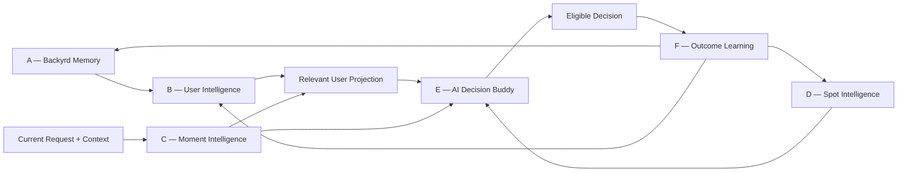

# Backyrd Decision North Star Constitution

Status: **N1 — PROPOSED CANONICAL CONSTITUTION**

Version: `backyrd-decision-north-star-constitution-v1`

Date: 2026-08-17

Scope: architecture and governance only; no Product or Production change

## 1. Constitutional authority

After review and merge, this document is the strategic-technical authority for future Backyrd Decision work. It extends, and does not erase, the scientific record in D0–D4 and Waves 1–4.

Where documents address the same question, the following precedence applies:

1. Product, privacy, Trust, consent, Product Eligibility and Distribution Eligibility contracts;
2. this North Star Constitution;
3. frozen scientific and treatment contracts for the experiment in which they were defined;
4. phase architecture and implementation documents;
5. experimental findings.

Historical results remain facts. In particular, Retrieval remains **NOT PROMOTED**, Wave 3C.1 remains **NOT PROMOTED**, and Wave 4 remains **FAIL / NOT PROMOTED**. N1 does not re-grade them.

Repository reconciliation: current merged `main` contains Wave 4 but no merged D4.3 or D4.3.1 artifact. D4.3/D4.3.1 are therefore treated here only as the active, controlled N6 experiment line. Their results do not become canonical evidence until separately reviewed, merged and reconciled.

## 2. Final North Star

Backyrd must answer:

> What is this person looking for right now, at this time, in this place and situation—and which available Spot fits both the moment and the person best?

Backyrd is not a conventional Spot search engine. It is a personal Decision Buddy that should become more useful as a person chooses to use it, while remaining honest about what it does not know.

The long-term product feeling is: **“Backyrd knows me.”** The operational trust question is: **“Would my buddy have suggested this?”**

This promise is not satisfied by engagement, popularity, raw click-through, model confidence or one aggregate ranking metric. A Decision must be plausible for the current request, current moment and person, based on legitimate evidence.

## 3. Product Constitution

The following principles are technical non-negotiables:

1. Backyrd first understands what the User wants now.
2. Backyrd remembers who the User is, within explicit purpose and privacy boundaries.
3. Backyrd determines which User knowledge is relevant now and which is not.
4. Backyrd increasingly understands what the User is likely to want in this kind of moment.
5. When evidence is insufficient, Backyrd must express uncertainty rather than manufacture familiarity.
6. Every legitimate Decision and Outcome may improve future understanding, but exposure alone is not preference and observation is not permission.
7. One imperfect Spot can be tolerable; a Recommendation that plainly fits neither the User nor the moment is a fundamental trust failure.

Consequences:

- eligibility is non-compensable;
- current explicit Intent has authority over History;
- missing evidence remains `UNKNOWN`, not negative evidence and not false certainty;
- learning uses evidence of unequal strength and corrects for exposure and position bias;
- explanations must be derived from the same evidence that affected the Decision;
- payments, popularity and engagement cannot buy Decision relevance.

## 4. Canonical six-system architecture

Deterministic Product Eligibility, Distribution Eligibility, Hard User Constraints and bounded retrieval remain authoritative boundaries around this architecture. The AI Decision Buddy receives only eligible Candidate IDs.

### A — Backyrd Memory

Memory answers: **What legitimately happened between Backyrd and this User?**

It is a purpose-bound, consent-aware First-Party evidence ledger, not a surveillance store. It distinguishes temporary Moment state, durable Product events, Outcomes, exposure metadata and derived learning. One Moment is temporary; repeated, consented Outcomes across moments may support a durable pattern.

Memory must preserve event identity, time, source, consent purpose, evidence strength, relevant context, exposure/position where applicable, provenance and deletion state. It must support idempotency, correction, export and deletion.

### B — User Intelligence

User Intelligence answers: **What do we currently believe about this person, and how certain are we?**

It incorporates the validated Wave-3B.1 Taste Engine and extends it with:

- Global Taste;
- Place-Type Taste;
- Contextual Taste;
- Behavioral and Occasion Patterns;
- positive and negative Evidence kept distinct;
- Confidence, Recency and Drift;
- relevant Memory references;
- explicit `UNKNOWN` state.

User Intelligence describes the User. It does not decide Candidate eligibility or final rank. It remains city-portable and must not infer sensitive demographics or hidden identity traits.

### C — Moment Intelligence

Moment Intelligence answers: **What does this User want now?**

It resolves Current Request, time/day, location/city context, social situation, occasion, energy, budget, spontaneity, activity, duration, distance willingness, explicit constraints and mood/vibe when legitimately available. Each field has source, confidence and freshness.

Moment state is immutable during one Decision and temporary afterward. Only a legitimate event or Outcome about that moment may later become Memory. Moment Intelligence does not write long-term Taste directly.

### D — Spot Intelligence

Spot Intelligence answers: **What is this Spot, what evidence supports that description, and in which moments can it fit?**

It gives Users, moments and Spots a compatible, versioned concept language. Evidence may come from canonical Spot data, Backyrd-derived observations, community/Outcome Evidence and Owner-provided claims. Every claim requires provenance, freshness and confidence; missing data stays `UNKNOWN`.

Owner claims are Evidence, never truth. Conflicts are visible and resolved by a versioned evidence policy rather than by payment status.

### E — AI Decision Buddy

The AI Decision Buddy answers: **Which of these already eligible Spots best fits this person in this moment?**

It may rank Candidates, interpret bounded interactions, express uncertainty and emit evidence-bound reason codes. It may not create Candidate IDs, alter eligibility, see Latent Truth, receive private Trust Evidence, consume unnecessary raw History or silently turn uncertainty into certainty.

The model and provider are replaceable. Backyrd's durable asset is its consented Memory, User Intelligence, Moment Intelligence, Spot Intelligence, Outcomes, contracts and evaluation system—not one provider.

### F — Outcome Learning

Outcome Learning closes the loop:

`Decision → exposure → interaction → choice/intent → visit → explicit feedback → Outcome → Memory → Intelligence → next Decision`.

Outcome Evidence is generally stronger than superficial interaction. Learning must record exposure and ranking propensity, separate non-action from dislike, avoid self-reinforcing popularity loops, support exploration and remain reversible when data is corrected or consent is withdrawn.

## 5. Authority hierarchy

The invariant runtime order is:

1. Product Eligibility;
2. Distribution Eligibility;
3. explicit Hard User Constraints;
4. Current Intent and Moment authority;
5. retrieval over eligible inventory;
6. relevant User, Moment and Spot evidence;
7. Decision ranking;
8. confidence and evidence-backed explanation.

No lower layer can compensate for a violation above it. Taste personalizes within the current valid region. AI output is untrusted until schema, Candidate identity, completeness and eligibility are deterministically validated.

## 6. Relevant User Projection

An AI Decision Buddy must never receive years of raw History. `Relevant User Projection` is the versioned, auditable answer to:

> Which parts of what Backyrd knows about this User are relevant to this Decision?

The Projection contains only:

- applicable Global, Place-Type and Contextual preferences;
- applicable Occasion/behavior patterns;
- signed affinity and calibrated Confidence;
- Recency/Drift state;
- compact provenance summaries;
- conflicts and `UNKNOWN`;
- explicit reasons for inclusion or exclusion of User knowledge.

Selection is controlled by Current Intent and Moment. It is compact, privacy-aware, token-efficient and deterministic or deterministically validated. It cannot include raw event streams, unrelated contexts, sensitive inferences, Latent Truth or private Trust Evidence.

## 7. Confidence as Product behaviour

Confidence is decomposed rather than represented by one opaque score:

| Confidence | Question | Owner |
|---|---|---|
| Signal Confidence | How reliable is this individual Evidence item? | Memory/evidence contract |
| User Knowledge Confidence | How well supported is this User belief? | User Intelligence |
| Moment Understanding Confidence | How clearly is the current request/situation understood? | Moment Intelligence |
| Spot Intelligence Confidence | How reliable and complete is this Spot claim? | Spot Intelligence |
| Decision Confidence | How sufficient and mutually consistent was the evidence for this ranking? | Decision Buddy + deterministic validator |

Decision Confidence is derived from the other layers and Candidate separation; it is not the AI model's self-confidence. Low Confidence reduces History influence, may trigger clarification or broader safe options, and changes how uncertainty is communicated. It never relaxes a Hard Constraint.

## 8. Relational explainability

The long-term explanation contract is:

`RECOMMENDATION + WHY FOR YOU + WHY NOW + CONFIDENCE/UNCERTAINTY`.

Every claim must point to Flight Recorder Evidence that affected the Decision. Explanations may omit sensitive or unnecessary detail, but may not invent support after ranking. If the system cannot support a “for you” claim, it must explain the request/moment fit without pretending to know the User.

## 9. Cross-city portability

User Intelligence is city-independent. A User with Basel History must retain applicable Global, Place-Type, Contextual and Occasion knowledge in Copenhagen even with zero local visits. The new city contributes local Spot Intelligence and availability; it does not reset the User.

Future acceptance must compare same-User Decisions across a familiar and unseen city while holding the relevant Moment constant. Portability passes only if applicable User projections remain stable, local data is not fabricated, Cold-City uncertainty is honest and recommendations improve over a fully neutral User control without city-specific leakage.

## 10. Owner Premium boundary

The immutable business contract is:

> **PAY TO BE UNDERSTOOD — NOT PAY TO RANK.**

Owner Premium may provide deeper Spot Intelligence controls, structured descriptions, additional verifiable attributes, better update workflows, analytics/insights and future Owner tools.

Owner Premium may never directly buy ranking position, Utility bonus, Personalization bonus, Distribution priority, eligibility or preferential model treatment. Any ranking effect must be indirect and evidence-mediated:

`more truthful, relevant Spot Evidence → more precise fit in genuinely matching moments`.

Owner claims require provenance and can be contradicted, downgraded or withheld by Backyrd/Outcome Evidence. Payment status is prohibited as a Decision feature and must be covered by feature-lineage and counterfactual tests.

## 11. Memory and privacy boundary

“Backyrd knows me” must never become “Backyrd watches me.”

Eligible Memory sources are purpose-bound First-Party events such as explicit requests, Decision exposures with position/propensity, Spot opens, saves, navigation/reservation intent, verified visits, reviews/Moments, explicit positive or negative feedback, onboarding choices and consented Product Outcomes. Each event must have a documented learning purpose and strength.

Prohibited collection or inference includes cross-app tracking, purchased behavioral data, contacts, Wi-Fi scanning, device fingerprints for personalization, continuous precise movement trails, covert audio, sensitive demographic/health/religion/sexuality inference, private Trust/moderation evidence in Decision models and non-consented analytics repurposing.

Mandatory controls:

- explicit purpose and lawful/consent basis before learning;
- data minimization and separation of raw Evidence from derived Intelligence;
- purpose-specific retention schedules defined before N2 storage ships—no indefinite default;
- consent withdrawal stops new learning and triggers the defined suppression/deletion path;
- account deletion cascades through raw and derived Decision data;
- User access, export, correction, reset and deletion;
- RLS, least privilege, service-only writes and auditable provenance;
- missing consent produces neutral/unknown behavior, never suspicion or negative Taste.

## 12. Existing architecture disposition

| Existing component | Disposition | Constitutional rationale |
|---|---|---|
| Structured Intent | **KEEP + INTEGRATE** | foundation of Moment Intelligence; version and broaden without weakening explicit semantics |
| Hard Constraints | **KEEP** | promoted non-compensable User Eligibility boundary |
| Product Eligibility | **KEEP** | proven authoritative Product boundary |
| Distribution Eligibility | **KEEP** | proven Trust/Distribution boundary; never exposed to AI as private evidence |
| Wave-2.x Retrieval | **HARDEN** | materially improved Candidate availability but remains NOT PROMOTED under D4.1 |
| Semantic Retrieval | **KEEP + HARDEN** | useful Recall source; never final Utility truth |
| Wave-3B.1 Taste Engine | **INTEGRATE** | validated User Intelligence foundation; historical limitations remain visible |
| Contextual Taste | **INTEGRATE + HARDEN** | valid hierarchical User evidence, not a standalone Decision policy |
| Wave-3C.1 Personalized Fit | **EVIDENCE ONLY + REPLACE AS RANKER** | safe boundary evidence; standalone integration remains NOT PROMOTED |
| Wave-4 Utility/Fusion | **EVIDENCE ONLY + DEPRECATE AS TARGET CORE** | valid negative evidence; deterministic fusion remains FAIL / NOT PROMOTED |
| Decision Lab | **KEEP + HARDEN** | scientific control plane for causal, lifecycle, cross-city and end-to-end evaluation |
| Flight Recorder | **KEEP + HARDEN** | required evidence lineage, attribution and explanation source |
| D2/D2.1/D2.2/D3 contracts | **KEEP** | frozen quality, treatment and diagnostic foundations; future contracts extend rather than rewrite them |
| D4.3/D4.3.1 AI experiment line | **EVIDENCE ONLY pending merge** | controlled N6 precursor; no canonical result exists on current `main` |

## 13. North-Star success definition

A fundamental trust failure is a Recommendation whose direction plainly fits neither the User nor the moment. N9 must operationalize this without replacing scientific metrics:

- pre-register a `User × Moment Plausibility` evaluator and catastrophic mismatch taxonomy;
- measure eligibility, Candidate availability, conditional ranking, personalization, context, Confidence and explanation separately;
- run same User/different Moment, same Moment/different User, Cold/Mature, sparse/ambiguous and cross-city treatments;
- require evidence-backed human review for ambiguous trust failures;
- in a consented Closed Beta, collect lightweight “why this did/didn't fit” Outcomes and audit position/exposure bias;
- freeze Beta gates before reading Beta outcomes;
- never use retention or clicks as a substitute for Decision plausibility.

One aggregate lift cannot compensate for systematic mismatch in a cohort, city, context or maturity state.

## 14. Governance

Material changes to Memory purpose, Intelligence semantics, confidence, Owner evidence, AI input/output, learning or promotion gates require a versioned contract, migration/rollback plan where applicable, privacy review and prospective validation. Historical artifacts are append-only evidence.

Provider or model changes are replaceable implementation choices. They must be evaluated under the same frozen input/output, safety, cost and quality contracts; no provider becomes constitutional architecture.

## 15. Final verdicts

- **DECISION NORTH STAR CONSTITUTION — PASS**
- **FINAL DECISION ARCHITECTURE — DEFINED**
- **OWNER PREMIUM RANKING BOUNDARY — DEFINED**
- **USER MEMORY & PRIVACY BOUNDARY — DEFINED**
- **N2 MEMORY & USER INTELLIGENCE — READY**
- **PRODUCTION — UNCHANGED**
